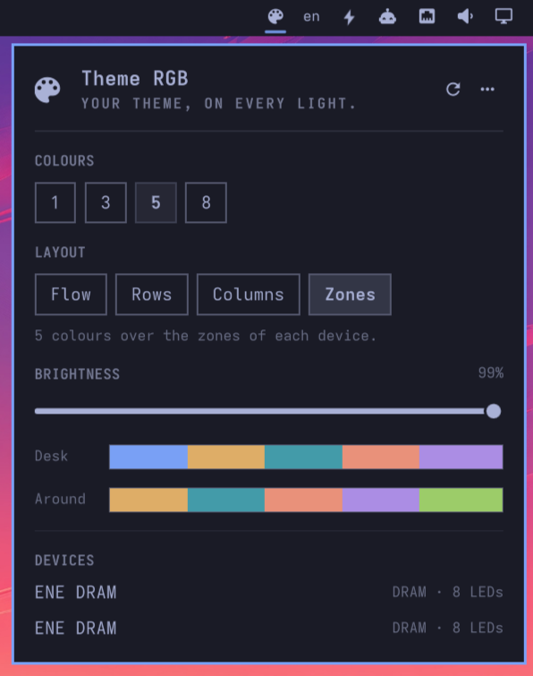

# omarchy-theme-rgb

**Your theme, on every light.**



Lights every device [OpenRGB](https://openrgb.org) manages in the colours of
the current [Omarchy](https://omarchy.org) theme. Switch themes and your
keyboard, mouse, RAM, fans and strips follow; log in and they already match.
A bar panel picks how many theme colours, how they lie on a keyboard, and how
bright.

Omarchy retints ASUS ROG and Framework keyboards itself. This plugin does the
same for everything OpenRGB can see, along the lines of
[omacom/omarchy#12199](https://github.com/omacom/omarchy/pull/12199), packaged
as a shell plugin you can add and remove.

## Install

```bash
omarchy-pkg-add openrgb      # if you do not have it yet
omarchy plugin add https://github.com/huacnlee/omarchy-theme-rgb.git --enable
```

The plugin runs as a service inside `omarchy-shell` and puts a palette glyph
in the bar. It syncs once when the shell starts and again every time
`omarchy theme set` finishes or you change a setting.

Remove it with `omarchy plugin remove huacnlee.theme_rgb`. That also stops
the headless OpenRGB server the plugin keeps; the `openrgb` package stays
installed until you remove it yourself.

Dependencies: the `openrgb` package (the panel offers to install it), plus
`jq` and ImageMagick's `magick`, which Omarchy ships. Nothing else.

## The panel

Click the palette glyph (or `omarchy-shell huacnlee.theme_rgb toggle`).

- **Colours** — `1`, `3`, `5` (the default) or `8`. *1* is the accent on
  every device. *3*, *5* and *8* are the first that many of the theme's own
  colours, in an order the script works out per theme (below). There is
  nothing to pick by hand: Omarchy is chef's choice.
- **Layout** — where several colours go. *Flow* lays bands along each
  device's LEDs (top to bottom on most keyboards). On keyboards, *Rows* and
  *Columns* place the bands by where each key actually sits, and *Zones*
  colours the function keys, main block, modifiers, navigation cluster,
  numpad and logo in turn; on other devices *Zones* colours each OpenRGB zone
  (a mouse's logo, wheel and strip, say) in turn.
- **Brightness** — 10–100 %. Scales the colour values themselves, so it
  works the same in every OpenRGB mode; it is the only change made to what
  the theme says.
- **Preview** — the exact colours the LEDs get, as bands.
- **Devices** — what OpenRGB found on the last sync, with LED counts.

**Menu** — the `󰇘` button in the header lists *Sync now* and *GitHub*.

**Without OpenRGB** the panel shows a welcome page instead of the settings,
with an *Install OpenRGB* button: it opens a floating terminal running
`omarchy-pkg-add openrgb`, and the panel switches to the settings by itself
once the package is in place.

### How the colours are chosen

The candidates are the accent plus `red`, `orange`, `yellow`, `green`, `cyan`,
`blue`, `magenta` and `brown` from the theme's `colors.toml` — never
background or foreground, which would light as dark or colourless bands.
When a theme provides an ANSI palette, the coloured slots `color1`–`color6`
and their bright variants `color9`–`color14` supplement any semantic
candidates; background/foreground slots `color0`, `color7`, `color8` and
`color15` stay excluded.
Greys (saturation under 15 %) and very dark or very light tones (lightness
outside 15–90 %) are dropped.

The accent comes first: it is the theme's colour for borders, the prompt and
selections. The rest are ordered by the **current wallpaper** — the biggest
thing a theme shows. The wallpaper is reduced to twelve colour clusters
(from a 160 px thumbnail, a tenth of a second) and each theme colour scores
by how much of the wallpaper sits within 60° of its hue, so a purple city
puts magenta before yellow and a jade forest puts cyan and green before
red. A wallpaper with no colour to speak of leaves the order to vividness:
the colours the theme made saturated and mid-light are its character.

A near-duplicate of a colour already taken (hue within 12°, saturation and
lightness within 25 points) is skipped — most themes make the accent one of
the named colours, and it lights once. *3*, *5* and *8* take the first that
many — on the desk. The keyboard, mouse, mousemat, headset and gamepad get
the bands; everything else (the screen's backlight, strips, RAM,
motherboard, case) is ambient light and shows the accent alone: one colour
reads as the theme from across the room, five bands on a monitor's backlight
do not. A theme with fewer usable colours lights fewer; a grey
theme lights the accent alone. Changing the wallpaper re-syncs within a few
seconds. The LEDs get the theme's exact hex values, scaled only by the
brightness setting — no gamma, no mixing toward white.

Several colours always sit in contiguous bands with hard edges between them,
never blended. Keyboard: `←`/`→` move within a row (on the brightness row
they step by 10), `↑`/`↓` between rows, `Enter` picks, `1`–`4` pick a colours
chip, `r` syncs now, `m` opens the menu, `Esc` closes.

Settings live in `~/.config/omarchy/theme-rgb.json`; the file is watched, so
editing it by hand applies too:

```json
{
  "mode": "palette",
  "colors": 5,
  "brightness": 100,
  "layout": "flow"
}
```

`mode` is `single` or `palette`, `colors` 3, 5 or 8, `brightness` 10–100 and
`layout` one of `flow`, `rows`, `columns`, `zones`. For the curious, the
script also honours `"single": "<variable>"` (which theme variable *1*
lights) and `"mode": "custom"` with `"custom": ["blue", "magenta"]` — neither
of which the panel exposes.

## Speed

Without an OpenRGB SDK server, every `openrgb` command re-probes all your
hardware, which takes seconds per call. The service therefore keeps a headless
`openrgb --server --noautoconnect` running for the life of the shell and holds
the first sync until the server answers on port 6742 (up to 20 s); a sync
then takes about a second. If you already run a server, the plugin's own
fails to bind and yours is used.

What `openrgb` said on the last sync is in
`~/.local/state/omarchy/theme-rgb/last-apply.log`. A sync that fails is
retried once after a few seconds; if it fails again the panel says so.

## Without the shell plugin

`bin/omarchy-theme-rgb-apply` is plain bash with no dependency on the shell.
It reads the same settings file. To use it as a theme hook instead:

```bash
omarchy hook install theme-set bin/omarchy-theme-rgb-apply
```

`omarchy-theme-rgb-apply stops` prints the colours it would light and
`omarchy-theme-rgb-apply variables` the theme's variables, without touching
OpenRGB.

## Development

```bash
make test        # bash tests with a mocked openrgb, plus the manifest contract
make qml-check   # qmllint against the Omarchy shell imports
make validate    # tests + lint + `omarchy plugin validate .`
make install     # symlink this checkout into ~/.config/omarchy/plugins and enable it
make apply       # run one sync by hand
```

The shell reloads the panel when its files change, but keeps a running
service instance; after editing `Service.qml` run `omarchy restart shell`.

## License

MIT
